# 🏢 API de Franquicias

Esta aplicación permite gestionar franquicias, sus sucursales y productos utilizando Java 17, Spring Boot 3, programación reactiva con WebFlux y MongoDB como base de datos.

---

## 🚀 Características

- Crear y consultar franquicias, sucursales y productos.
- Modificar stock y nombre de productos, sucursales y franquicias.
- Obtener el producto con mayor stock por sucursal.
- Arquitectura hexagonal con separación de capas.
- Documentación OpenAPI disponible con Swagger.
- Docker y Docker Compose listos para producción local.

---

## 🧾 Requisitos previos

Antes de iniciar, asegúrate de tener instalado:

- [Git](https://git-scm.com/)
- [Docker](https://www.docker.com/)
- [Docker Compose](https://docs.docker.com/compose/)
- [Java 17](https://adoptium.net/) y [Maven](https://maven.apache.org/) *(solo si quieres compilar sin Docker)*

---

## 📦 Clonar el repositorio

```bash
git clone https://github.com/BorisMejia/sucursal.git
```

```bash
cd sucursal
```
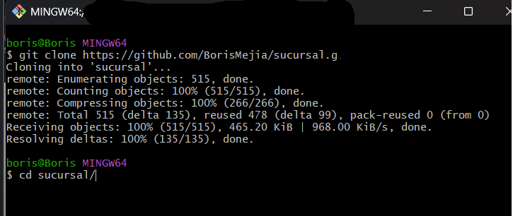

##  💾 Compilar y ejecutar los contenedores

>[!IMPORTANT]
> Ejecutar el siguiente comando en la terminal bash si se tiene java en el equipo

```bash
./mvnw clean package -DskipTests && docker-compose build --no-cache && docker-compose up
```

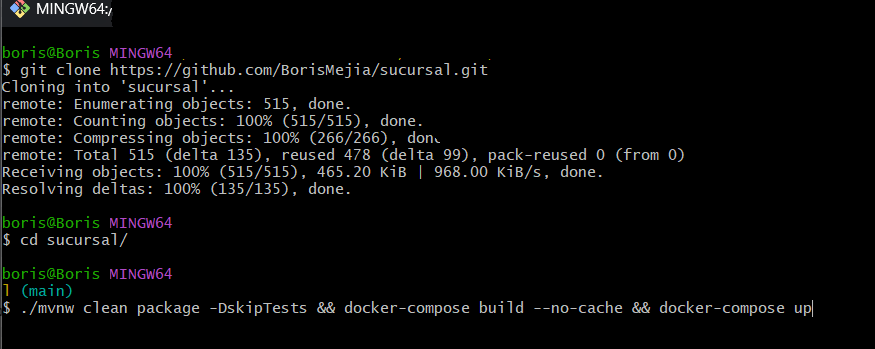

>[!IMPORTANT]
>Ejecutar el siguiente comando si no se tiene java

>[!NOTE]
>Se debe tener docker instalado

```bash
docker-compose up --build -d
```


## 🐋 Esperar que corrar los contenedores

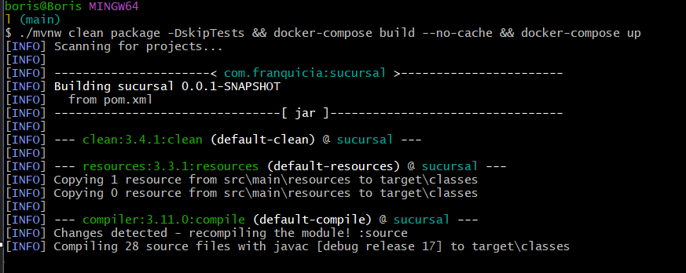

## 💻 URL para peticiones http

```bash
http://localhost:8080/swagger-ui/swagger-ui/index.html#/
```

## 🚀 Probar la API paso a paso con Swagger UI

### 1 · Abrir la interfaz

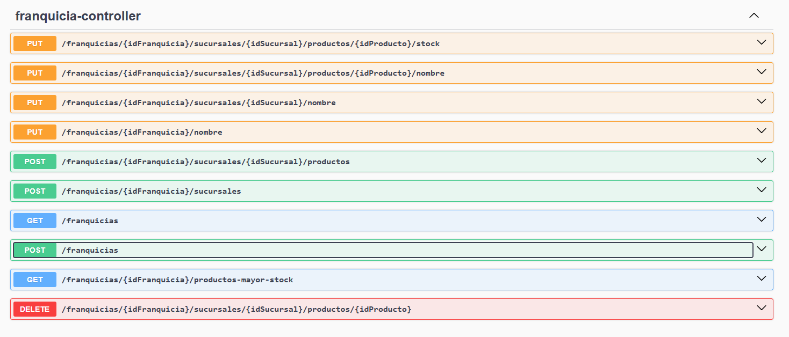

1. Accede a `http://localhost:8080/swagger-ui/swagger-ui/index.html#/`.
2. Estos son todos los metodos que se pueden probar

---

### 2 · Crear una franquicia

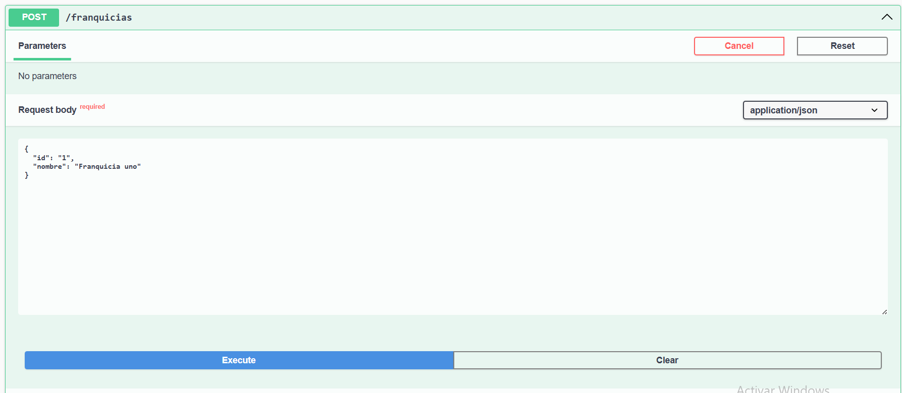

```json
POST /franquicias
Body:
{
  "nombre": "Franquicia uno"
}
```

### 3 · Crear una sucursal

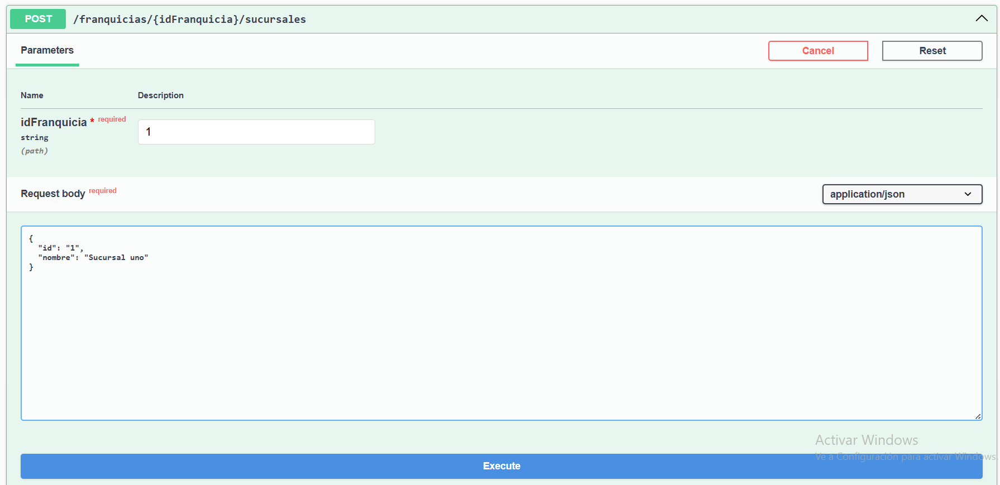

```json
POST /franquicias/{idFranquicia}/sucursales
Body:
{ 
  "id" : "1",
  "nombre": "Sucursal uno"
}
```

### 4 · Crear una producto

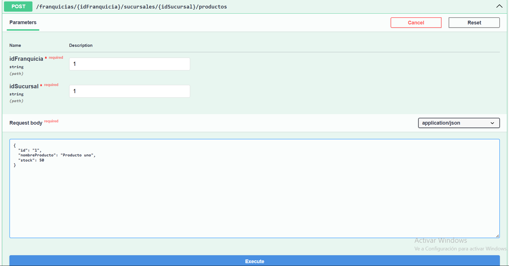

```json
POST /franquicias/{idFranquicia}/sucursales/{idSucursal}/productos
Body:
{ 
  "id" : "1",
  "nombreProducto": "Producto uno",
  "stock": 50
}
```

### 5 · Cambiar nombre de la franquicia 

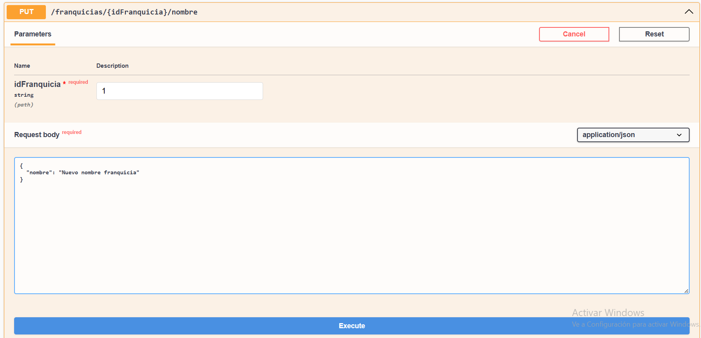

```json
PUT /franquicias/{idFranquicia}/nombre
Body:
{
  "nombre": "Nuevo nombre franquicia"
}
```

### 6 · Cambiar nombre de la sucursal

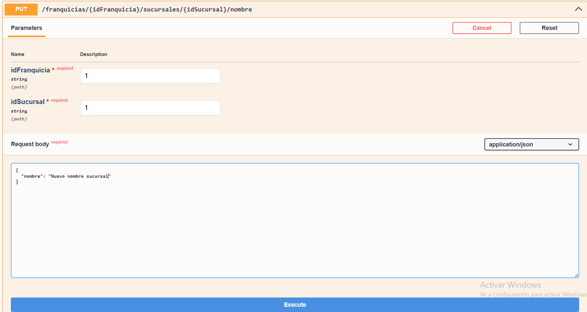

```json
PUT /franquicias/{idFranquicia}/sucursales/{idSucursal}/nombre
Body:
{
  "nombre": "Nuevo nombre sucursal"
}
```

### 7 · Cambiar nombre de un producto

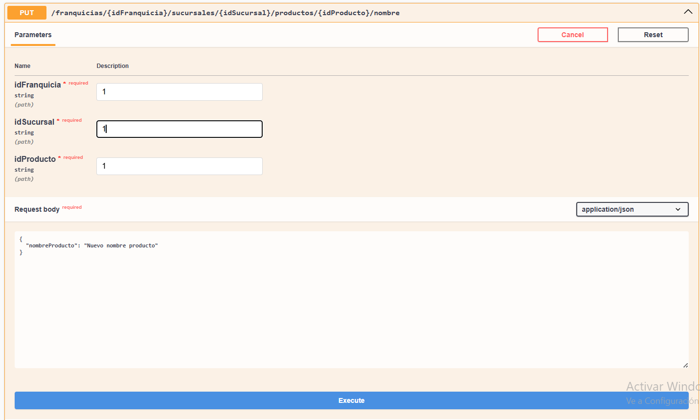

```json
PUT /franquicias/{idFranquicia}/sucursales/{idSucursal}/productos/{idProducto}/nombre
Body:
{
  "nombreProducto": "Nuevo nombre producto"
}
```

### 8 · Cambiar stock de un producto

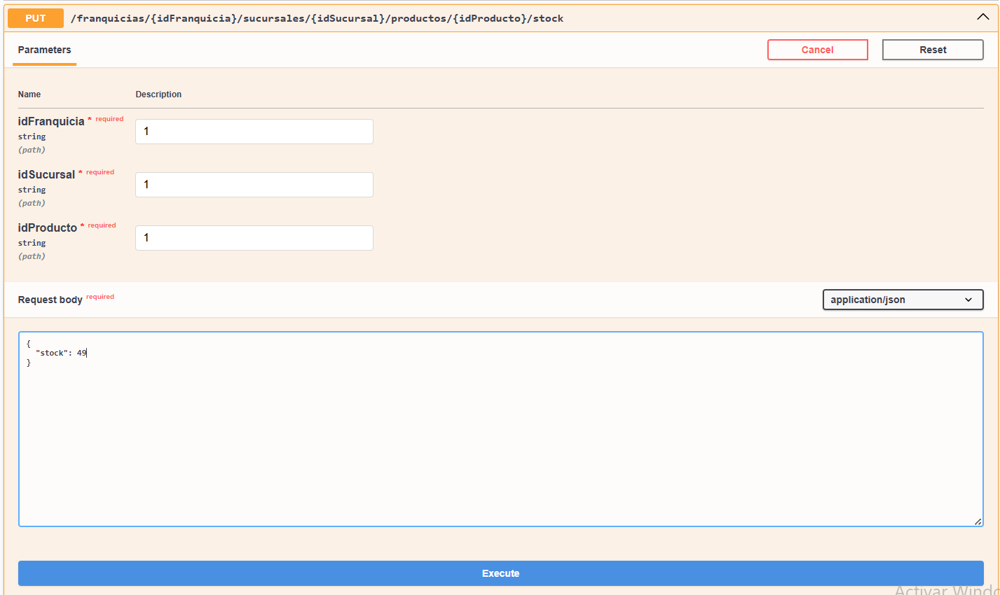

```json
PUT /franquicias/{idFranquicia}/sucursales/{idSucursal}/productos/{idProducto}/stock
Body:
{
  "stock": 49
}
```

### 9 · Eliminar un producto

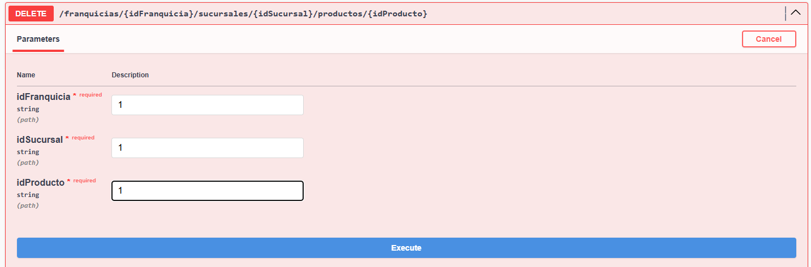

```json
DELETE /franquicias/{idFranquicia}/sucursales/{idSucursal}/productos/{idProducto}
Body:
{
  204
}
```

### 10 · Traen el producto con más stock de cada sucursal en una franquicia

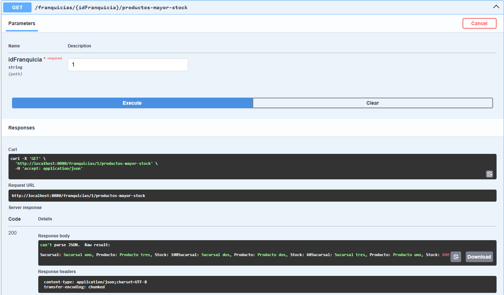

```json
PUT /franquicias/{idFranquicia}/sucursales/{idSucursal}/productos/{idProducto}
Body:
{
Sucursal: Sucursal uno, Producto: Producto tres, Stock: 100Sucursal: Sucursal dos, Producto: Producto dos, Stock: 60Sucursal: Sucursal tres, Producto: Producto uno, Stock: 800
}
```

### 11 · Todas las franquicias

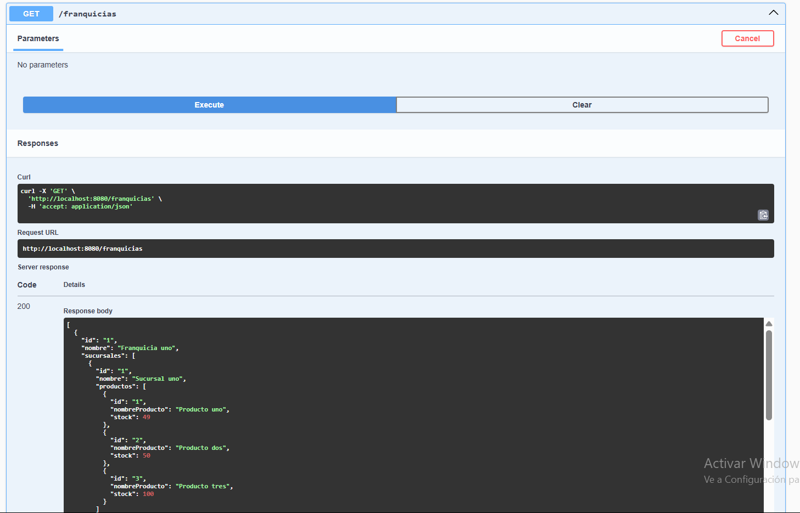

```json
PUT /franquicias/{idFranquicia}/sucursales/{idSucursal}/productos/{idProducto}
Body:
{
[
  {
  "id": "1",
  "nombre": "Franquicia uno",
  "sucursales": []
  }{
  "id": "2",
  "nombre": "Franquicia dos",
  "sucursales": []
  }
]
}
}
```
